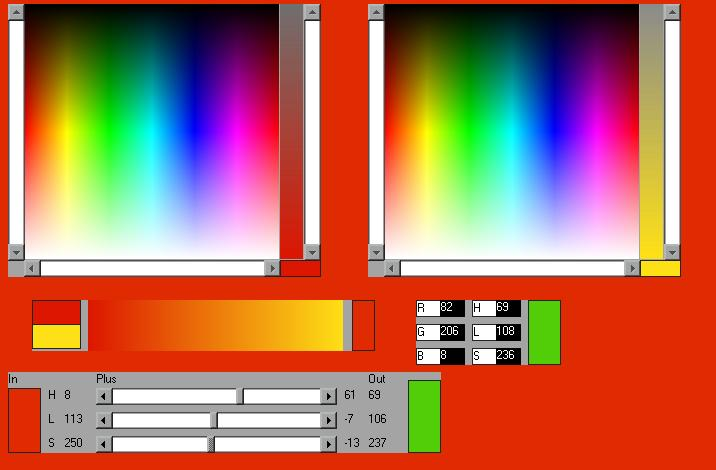

<div align="center">

## RGB\-HLS / Pick , Add , Report &amp; Mix Controls


</div>

### Description

use your Right Mouse Button to pick , Change and Mix Colours and report them back in RGB or HLS format
 
### More Info
 


<span>             |<span>
---                |---
**Submitted On**   |2007-01-15 18:14:44
**By**             |[Adrian Vella](https://github.com/Planet-Source-Code/PSCIndex/blob/master/ByAuthor/adrian-vella.md)
**Level**          |Intermediate
**User Rating**    |5.0 (10 globes from 2 users)
**Compatibility**  |VB 6\.0
**Category**       |[Graphics](https://github.com/Planet-Source-Code/PSCIndex/blob/master/ByCategory/graphics__1-46.md)
**World**          |[Visual Basic](https://github.com/Planet-Source-Code/PSCIndex/blob/master/ByWorld/visual-basic.md)
**Archive File**   |[RGB\-HLS\_\_\_2042711162007\.zip](https://github.com/Planet-Source-Code/adrian-vella-rgb-hls-pick-add-report-amp-mix-controls__1-67632/archive/master.zip)

### API Declarations

```
Private Declare Function GetPixel Lib "gdi32" (ByVal hdc As Long, ByVal X As Long, ByVal Y As Long) As Long
Private Declare Function SetPixel Lib "gdi32" (ByVal hdc As Long, ByVal X As Long, ByVal Y As Long, ByVal crColor As Long) As Long
```


